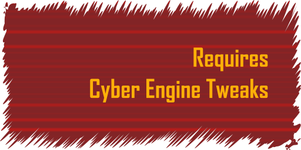

# Next Song

### Next Song is a mod for Cyberpunk 2077. 

### It allows you to attach key bindings to move radio songs forward and backward in playing radio stations

<a href="https://github.com/maximegmd/CyberEngineTweaks" title="Requires Cyber Engine Tweaks">
<picture>
  
</picture>
</a>


# Game Compatible Versions
- ### 2.1

# Setup

Drop the `NextSong` folder on the root of your Cyberpunk installation folder. If using Steam with defaults, the path may be
```
C:\Program Files (x86)\Steam\steamapps\common\Cyberpunk 2077\
```

When launching the game, open the binding menu of Cyber Engine Tweaks and bind the keys to `Next Song` and `Previous Song``


# Limitations

1. Not compatible with [RadioEXT](https://github.com/justarandomguyintheinternet/CP77_radioExt) at the moment. If it ever is, this message will be removed.
2. Some radio devices refuse to play some songs. Hitting `Next Song` or `Previous Song` will make it sound like skipping, but no new song will play because of this. Car radios and pocket radio play them all.
3. Hitting `Next Song` or `Previous Song` on a new station that started playing will start from index 0. Currently working on a way to identify already playing songs to continue from the song that is playing
4. Radio interlocution will not necessarily play when changing songs. The game randomly decides whether to play interlocution messages.
5. When an interlocution message is playing the back and forward keys will do nothing.

# Troubleshooting

## No song changes when in front of a radio device
**Possible cause**: Sometimes the Pocket Radio is ON while another device started playing or another radio is nearby and the mod captured either of them which would give the mod the wrong station to play songs from. This is because in the game multiple radio devices can be playing music at the same time.

**Suggested solution**: Turn the desired radio device OFF and ON again. This will trigger the method to get the station from it. 

## Songs seem to skip on radio devices when back/forwarding the track
**Possible cause**: Radio Stations in radio devices seem to play only a set of songs. The mod will iterate through all the songs in a radio station, but if the radio device does not have one of them on its list of songs that it can play, the game will refuse to play the song. Pocket Radio and Car Radio can play all songs.

**Suggested solution**: None (꒡︵꒡)

## The `Next Song` and `Previous Song` binded keys are not doing anything
**Possible cause**: For a reason I don't understand yet, sometimes the keybinds get reset.

**Suggested solution**: Open the Cyber Engine Tweaks method, click `Reload all mods`, then click on `Bindings` and rebind the keys

## The `Next Song` and `Previous Song` sound like they are skipping a song, but despite more skips than number of songs in the radio station no new song is playing
**Possible cause**: Unknown

**Suggested solution**: Open the Cyber Engine Tweaks method, click `Reload all mods`. Then turn OFF and ON the desired radio device. It should work afterwards.

